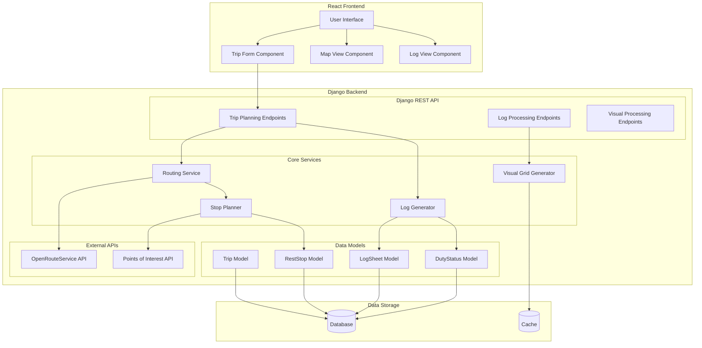

# HaulTrackr Backend

HaulTrackr is a full-stack application designed to help truck drivers plan routes and manage Electronic Logging Device (ELD) logs. The system takes into account Hours of Service (HOS) regulations, fuel stops, and rest requirements to generate optimal routes and compliant log sheets.

## System Architecture



## Features

- Route planning with OpenRouteService API integration
- Automatic rest stop planning based on HOS regulations
- Fuel stop calculation at 1000-mile intervals
- ELD log generation and visualization
- Multi-day trip support
- Real-time status updates

## Technical Stack

### Backend (Django)

- Django REST Framework for API endpoints
- SQLite database (can be scaled to PostgreSQL)
- Redis for caching (optional)
- OpenRouteService API for route calculations
- Custom services for:
  - Route planning
  - Stop scheduling
  - Log generation
  - Visual grid creation

### Frontend (React)

- React for UI components
- Map visualization
- Log sheet display
- Trip planning interface

## Core Components

### 1. Route Planner

- Handles trip creation and management
- Calculates optimal routes
- Integrates with external mapping services
- Manages location data

### 2. Stop Planner

- Calculates required rest stops
- Plans fuel stops
- Optimizes stop locations
- Handles time management

### 3. ELD Logger

- Generates electronic logging device sheets
- Tracks duty status changes
- Ensures HOS compliance
- Creates visual representations

## Data Models

### Trip Model

```python
class Trip:
    - current_location
    - pickup_location
    - dropoff_location
    - current_cycle_hours
    - created_at
```

### RestStop Model

```python
class RestStop:
    - name
    - location
    - coordinates
    - type (REST/FUEL/BOTH)
    - amenities
    - trip (ForeignKey)
    - planned_arrival
    - planned_departure
```

### LogSheet Model

```python
class LogSheet:
    - trip (ForeignKey)
    - date
    - log_data (JSON)
```

## API Endpoints

### Trip Planning

- `POST /api/trips/` - Create new trip
- `GET /api/trips/{id}/` - Get trip details
- `POST /api/trips/{id}/plan/` - Generate route plan

### Log Management

- `GET /api/logs/` - List all logs
- `GET /api/logs/{id}/` - Get specific log
- `POST /api/logs/generate/` - Generate new log

## Setup Instructions

1. Clone the repository
2. Create and activate virtual environment:
   ```bash
   python -m venv venv
   source venv/bin/activate  # On Windows: venv\Scripts\activate
   ```
3. Install dependencies:
   ```bash
   pip install -r requirements.txt
   ```
4. Set up environment variables:
   - Create `.env` file
   - Add required API keys
5. Run migrations:
   ```bash
   python manage.py migrate
   ```
6. Start the development server:
   ```bash
   python manage.py runserver
   ```

## Configuration

The system uses the following configuration parameters:

- `OPENROUTE_API_KEY` - API key for OpenRouteService
- `FUEL_STOP_INTERVAL_MILES` - Distance between fuel stops (default: 1000)
- `MAX_DRIVING_HOURS` - Maximum continuous driving hours (default: 11)
- `MAX_ON_DUTY_HOURS` - Maximum on-duty hours (default: 14)
- `REQUIRED_REST_HOURS` - Required rest period (default: 10)

## Contributing

1. Fork the repository
2. Create a feature branch
3. Commit your changes
4. Push to the branch
5. Create a Pull Request

## License

This project is licensed under the MIT License - see the LICENSE file for details.


